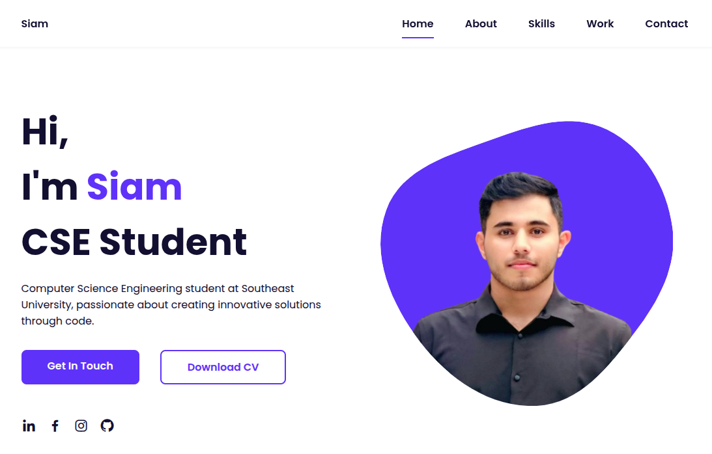

# K.M. Siam - Portfolio Website

> A modern, responsive personal portfolio website showcasing my journey as a Computer Science Engineering student at Southeast University.

## 🌟 Features

- **Fully Responsive Design** - Optimized for all devices (mobile, tablet, desktop)
- **Modern UI/UX** - Clean and professional interface with smooth animations
- **Interactive Sections** - Dynamic skills tabs and project showcases
- **Contact Form** - Integrated with Formspree for direct messaging
- **CV Download** - Direct PDF download functionality
- **Social Media Integration** - Links to all professional profiles
- **SEO Optimized** - Proper meta tags and semantic HTML

## 🛠️ Technologies Used

- **HTML5** - Semantic markup and structure
- **CSS3** - Modern styling with Flexbox and Grid
- **JavaScript** - Interactive functionality and animations
- **Boxicons** - Icon library for consistent iconography
- **Formspree** - Contact form backend service

## 📱 Sections

1. **Home** - Introduction with call-to-action buttons
2. **About** - Personal information and statistics
3. **Skills** - Technical skills and educational background (tabbed interface)
4. **Projects** - Portfolio of completed work
5. **Contact** - Contact information and message form

## 🚀 Getting Started

### Prerequisites
- A modern web browser
- Basic understanding of HTML/CSS/JavaScript (for modifications)

### Installation

1. Clone the repository:
```bash
git clone https://github.com/KMSiam/Siam.git
```

## 📁 Project Structure

```
portfolio-website/
├── index.html              # Main HTML file
├── assets/
│   ├── css/
│   │   └── styles.css      # Main stylesheet
│   ├── js/
│   │   └── main.js         # JavaScript functionality
│   ├── img/
│   │   ├── about.jpg       # About section image
│   │   ├── perfil.png      # Profile image
│   │   └── work*.jpg       # Project images
│   └── K.M.Siam_CV.pdf     # Downloadable CV
└── README.md               # Project documentation
```

## ⚙️ Customization

### Personal Information
- Update contact details in the contact section
- Replace images in `assets/img/` with your own
- Modify the CV file in `assets/` folder

### Styling
- Edit `assets/css/styles.css` for design changes
- Modify CSS variables in `:root` for color scheme
- Adjust responsive breakpoints as needed

### Content
- Update skills in the Professional tab
- Modify educational background in Educational tab
- Replace project images and descriptions

## 📧 Contact Form Setup

The contact form uses Formspree for backend processing:

1. Sign up at [Formspree.io](https://formspree.io)
2. Create a new form and get your endpoint
3. Replace the form action URL in `index.html`:
```html
<form action="https://formspree.io/f/YOUR_FORM_ID" method="POST">
```

## 🌐 Deployment

### GitHub Pages
1. Push your code to a GitHub repository
2. Go to Settings > Pages
3. Select source branch (usually `main`)
4. Your site will be available at `https://username.github.io/Siam`

### Netlify
1. Connect your GitHub repository to Netlify
2. Deploy automatically on every push
3. Custom domain support available

## 📱 Browser Support

- Chrome (latest)
- Firefox (latest)
- Safari (latest)
- Edge (latest)
- Mobile browsers (iOS Safari, Chrome Mobile)

## 🤝 Contributing

Contributions, issues, and feature requests are welcome! Feel free to check the issues page.

## 📄 License

This project is licensed under the MIT License.

## 👨💻 Author

**K.M. Siam**
- GitHub: [@KMSiam](https://github.com/KMSiam)
- LinkedIn: [K.M. Siam](https://www.linkedin.com/in/km-siam-973723291/)
- Email: k.m.siam2019@gmail.com

## 🙏 Acknowledgments

- Southeast University for the educational foundation
- Boxicons for the beautiful icon library
- Formspree for the contact form service
- [Bedimcode](https://youtu.be/AKNvTxWOdKw?si=MYaoNCWdW43b78JH) - YouTube tutorial that served as the foundation and inspiration for this portfolio design
- The web development community for inspiration and resources

---

⭐ **If you found this project helpful, please give it a star!** ⭐

## 📸 Preview

